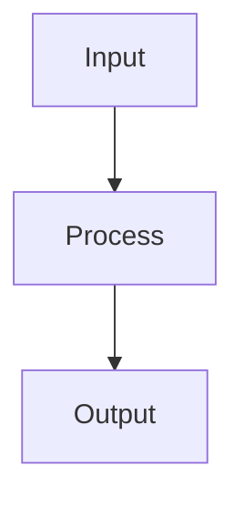

# CLAUDE.md - コードリーディングプロジェクト指示書

## プロジェクト概要

このリポジトリはOSSのコードリーディング結果を構造化して蓄積するためのものです。
対象OSSは `target/` ディレクトリにgit submoduleとして配置されています。

- **対象OSS**: （プロジェクト作成時に記入）
- **調査目的**: （プロジェクト作成時に記入）
- **重点領域**: （プロジェクト作成時に記入）

## ディレクトリ構成

```
.claude/CLAUDE.md          ← このファイル（常に参照）
target/                    ← 対象OSSソースコード（git submodule）
docs/src/                  ← 公開ドキュメント（mdbook用）
.state/                    ← 調査状態管理（Claude Code用）
templates/                 ← ドキュメントテンプレート
scripts/                   ← ユーティリティスクリプト
```

## 調査プロトコル

### セッション開始時（必ず実行）

1. `.state/exploration-log.md` を読んで全体の進捗を把握
2. `.state/next-actions.md` を読んで今回の作業を決定
3. 必要に応じて `.state/context-index.md` で既存知見を確認
4. 前回の続きの場合は `.state/sessions/` の該当ファイルを読む

### 調査中

#### ソースコードの読み方
- **まず `rg`（ripgrep）や `grep` で当たりをつける**。大きなファイルを丸ごと読まない
- クラス定義、関数シグネチャ、import文から構造を把握し、必要な箇所だけ深く読む
- `rg -n "class ClassName" target/` や `rg -n "def method_name" target/` を活用

#### 既存ドキュメントの活用（コンテキスト節約）
- **確信度マーカーに基づいて再読を判断する**:
  - `[VERIFIED]` → ドキュメントを信頼してよい。ソース再読不要
  - `[INFERRED]` → 推測を含む。深堀り時はソース確認を推奨
  - `[SHALLOW]` → 概要のみ。詳細調査時は必ずソース確認
- submodule更新後は関連ドキュメントの再検証を検討

#### ドキュメントへの書き込み
- 発見は適切な `docs/src/` 配下のファイルに記録
- 新しいコンポーネントを発見したら `docs/src/components/` にディレクトリを作成
- テンプレート（`templates/`）を参照して一貫した形式で書く
- **ファイル参照は必ず `target/` からの相対パスと行番号を記載**: `target/vllm/path/to/file.py:123`

### セッション終了時（必ず実行）

1. `.state/exploration-log.md` を更新（1行追加）
2. `.state/context-index.md` を更新（新規/変更ドキュメントを反映）
3. `.state/next-actions.md` を更新（次回やるべきことを記載）
4. `.state/sessions/` にセッション記録を作成/更新
5. `docs/src/` の変更があれば `python scripts/gen_summary.py` でSUMMARY.md更新

## ドキュメント規約

### 深度マーカー

各セクションの見出しに付与:
- `[SHALLOW]` - 概要レベル。名前と役割を知っている程度
- `[MEDIUM]` - 中程度。主要なAPI、データフロー、設定を理解
- `[DEEP]` - 深い理解。内部実装、エッジケース、最適化を把握

### 確信度マーカー

各セクションの見出しに付与:
- `[VERIFIED]` - ソースコードで確認済み。信頼してよい
- `[INFERRED]` - コード構造やコメントからの推測を含む。要確認
- `[TODO]` - 未調査。プレースホルダとして存在

### ファイル参照形式

```markdown
**参照**: `target/vllm/v1/core/sched/scheduler.py:315` (schedule)
```

### 図の記法

Mermaid記法を使用（mdbook-mermaidで描画）:

````markdown

````

ASCII図も可（Mermaidで表現しにくい場合）。

## 調査フェーズガイド

### Phase 0: オリエンテーション
- 対象OSSのREADME、公式ドキュメントを読む
- 主要エントリポイントを特定
- `docs/src/architecture/overview.md` を作成
- `docs/src/glossary.md` に用語を蓄積開始

### Phase 1: 垂直スライス
- ユーザー入力から最終出力までの1パスを完全に追跡
- `docs/src/architecture/data-flow.md` を作成
- 全コンポーネントの「存在」を認識し、優先度をつける

### Phase 2: コンポーネント別深堀り
- 優先度順にコンポーネントを調査
- 各コンポーネントの `summary.md` + 詳細ドキュメントを作成
- 相互参照を更新

### Phase 3: 横断的機能の理解
- 複数コンポーネントにまたがる機能を調査
- 設定伝播、エラーハンドリング、最適化パターン等

## コンテキスト管理

### 読み込み優先度

```
レベル0（常に読む）: .state/exploration-log.md, next-actions.md （〜50行）
レベル1（セッション開始時）: context-index.md （〜50行）
レベル2（必要時）: 対象コンポーネントの summary.md （〜100行）
レベル3（深堀り時）: 個別ドキュメント
レベル4（ピンポイント）: target/ 内のソースコード
```

### context-index.md の維持

新しいドキュメントを作成/大幅更新したら、context-index.md に1行サマリを追加/更新する。
これにより、次回セッションで「どのドキュメントに何が書いてあるか」を即座に把握できる。

## タスク実行

```bash
uv run task docs-build    # mdbookビルド
uv run task docs-serve    # ローカルプレビュー
uv run task summary       # SUMMARY.md自動生成
uv run task stats         # 調査進捗表示
```
